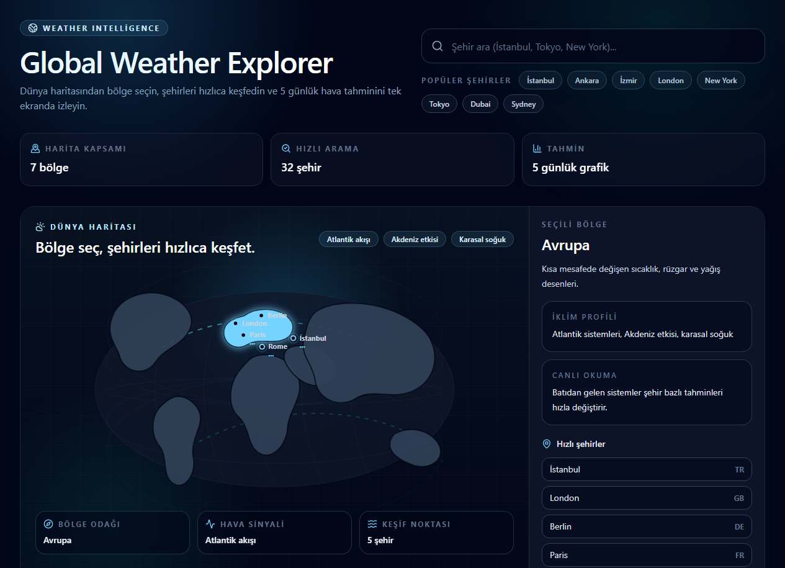
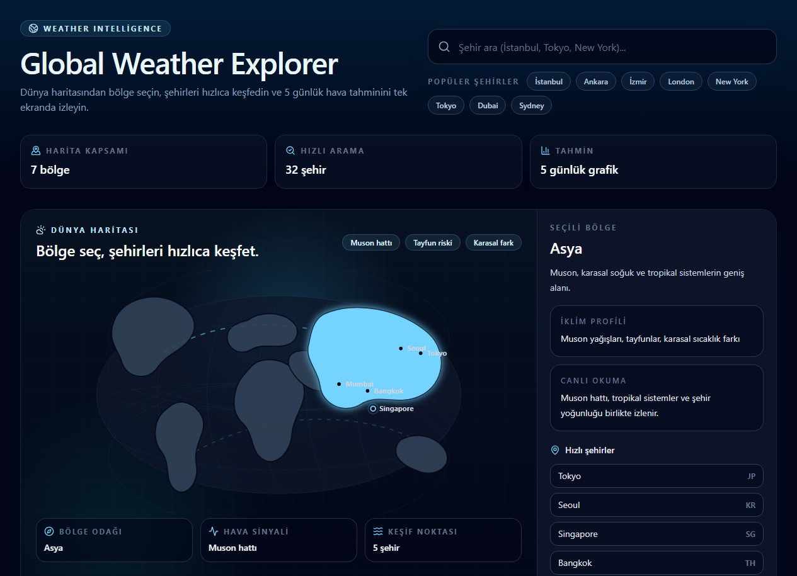
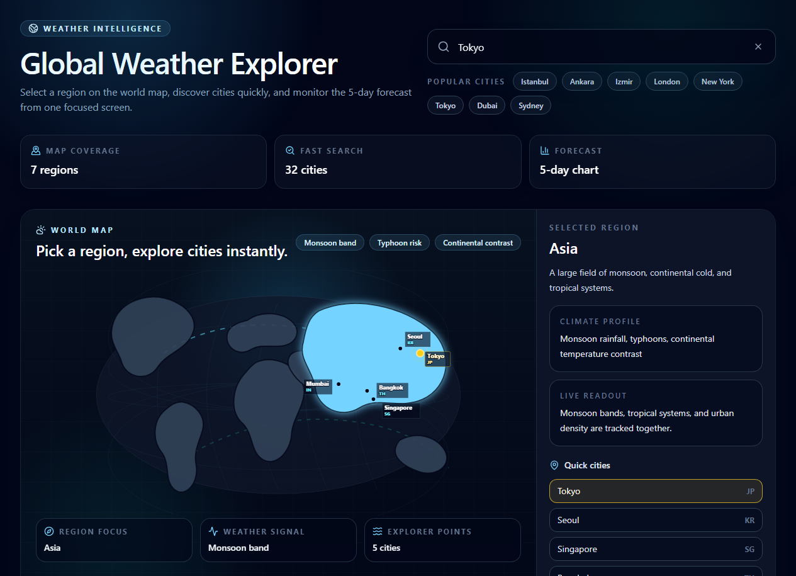
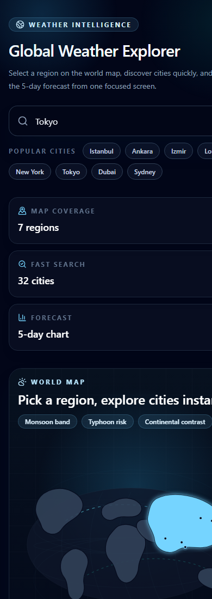

# Global Weather Explorer

Interactive weather dashboard with a world-map first screen, regional discovery, live city pins, smart search, weather-aware atmosphere, current conditions, and a 5-day forecast console powered by OpenWeatherMap.


Repository: [github.com/noutrexx/weather-dashboard](https://github.com/noutrexx/weather-dashboard)

## Preview



## Visual States

| Home Map | Region Focus | City Selected | Mobile |
| --- | --- | --- | --- |
|  |  |  |  |

## What It Does

- Starts with a clickable world-region map instead of an empty search-only screen.
- Lets users select regions such as Europe, Asia, Africa, Oceania, and the Americas.
- Adds city pins, live temperature badges, animated regional flow lines, climate highlights, and visual map metrics.
- Shows curated quick cities for each selected region.
- Provides smart city suggestions, keyboard navigation, recent searches, and popular city shortcuts for faster searching.
- Supports shareable map states through `region` and `city` URL query parameters.
- Changes the dashboard atmosphere based on the selected city's weather condition.
- Presents selected-city weather in a premium console with local time, key metrics, and forecast chart.
- Displays current temperature, humidity, wind, pressure, and feels-like values.
- Visualizes the 5-day temperature and humidity forecast with Recharts.
- Handles missing API keys, invalid cities, pending keys, and network errors with clear English messages.

## Tech Stack

| Area | Tools |
| --- | --- |
| Frontend | React, TypeScript, Vite |
| Styling | Tailwind CSS, clsx, tailwind-merge |
| Weather Data | Axios, OpenWeatherMap |
| Data Visualization | Recharts |
| Icons | Lucide React |
| Tooling | ESLint, TypeScript project references |

## Experience Details

- **Map-first navigation:** users can browse by region before typing a city name.
- **Live pin layer:** when an OpenWeatherMap key is available, regional city pins show fresh temperature badges.
- **City console:** selecting a city turns the lower section into a focused weather console instead of a disconnected result card.
- **Search memory:** the dashboard remembers recent city selections in local storage.
- **Responsive density:** desktop keeps labels and temperature badges visible; mobile reduces map label density for readability.

## Setup

Requirements:

- Node.js 18 or newer
- npm
- OpenWeatherMap API key

Install dependencies:

```bash
git clone https://github.com/noutrexx/weather-dashboard.git
cd weather-dashboard
npm install
```

Create an environment file:

```bash
copy .env.example .env
```

Add your OpenWeatherMap key:

```env
VITE_OPENWEATHER_API_KEY=your_api_key_here
```

Check the API key:

```bash
node scripts/check-api.mjs
```

Run locally:

```bash
npm run dev
```

The Vite dev server usually runs at [http://localhost:5173](http://localhost:5173).

## Scripts

| Script | Purpose |
| --- | --- |
| `npm run dev` | Start the Vite development server |
| `npm run build` | Type-check and build for production |
| `npm run preview` | Preview the production build |
| `npm run lint` | Run ESLint |

## Project Structure

```text
src/
  components/  Search, map, weather cards, alerts, charts
  data/        World-region and city-option metadata
  hooks/       Fetching and debounce hooks
  i18n/        English UI copy and API message translation
  services/    OpenWeatherMap client
  types/       Weather API response types
  utils/       Forecast, error, and class-name helpers
```

## Production Notes

- New OpenWeatherMap API keys can take 10–120 minutes to become active.
- The Vite dev proxy injects the API key, metric units, and English language parameters so the key never appears in the browser bundle during development.
- For production deployments, define `VITE_OPENWEATHER_API_KEY` in your hosting platform's environment variables (Vercel, Netlify, etc.).
- The app defaults to Celsius (`units=metric`). Changing to Fahrenheit requires updating the `units` param in `weatherApi.ts` and the unit labels in `i18n/en.ts`.
- The current chart bundle includes Recharts; code-splitting can be added later if stricter bundle budgets are needed.

## License

MIT License. See [LICENSE](./LICENSE).
