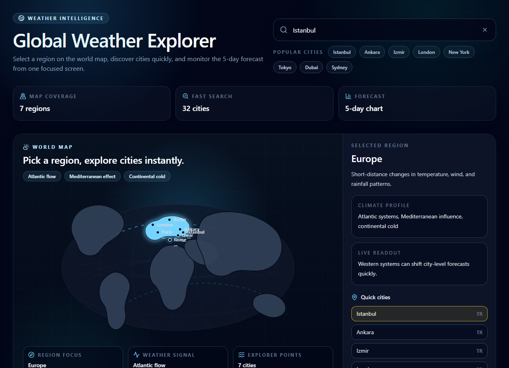
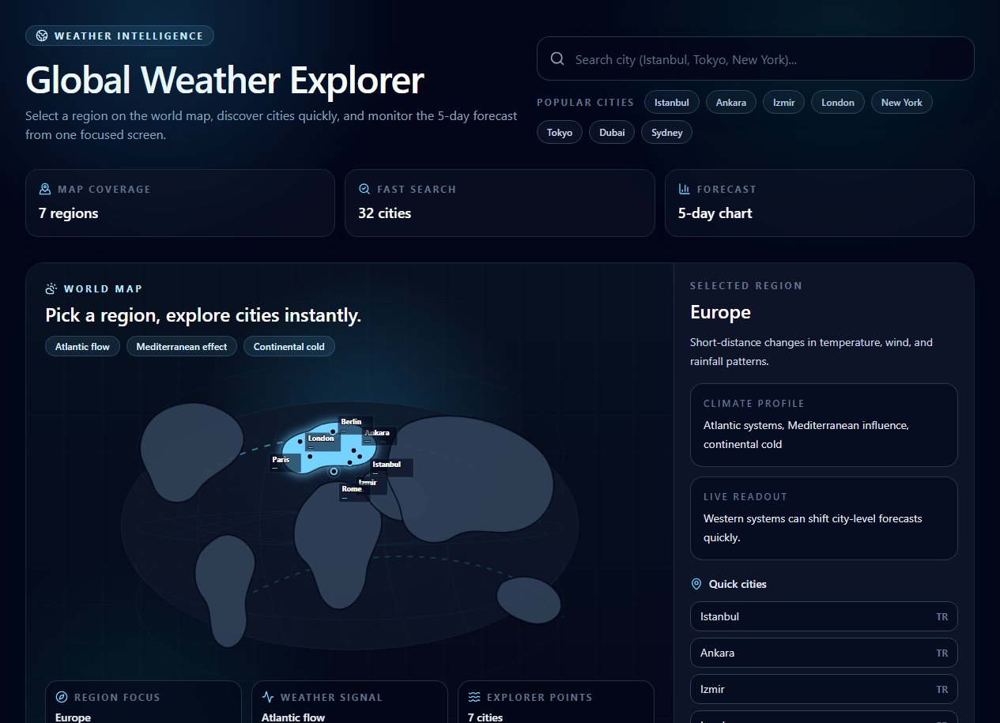
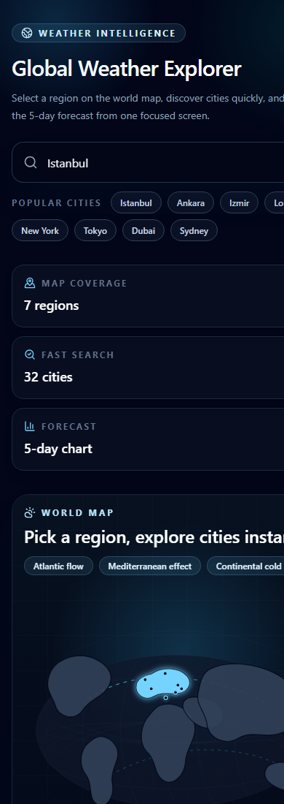

# Weather DashboardA weather dashboard built with React, TypeScript, and Vite. When a city search is performed, current weather conditions, key metrics, and a 5-day temperature and humidity chart are displayed via the OpenWeatherMap API.Repository: [github.com/noutrexx/weather-dashboard](https://github.com/noutrexx/weather-dashboard)## Screenshots### Desktop### Empty State### Mobile## Features- Debounced city search with a 500 ms delay- Current temperature, humidity, wind, pressure and feels-like values- 5-day forecast chart built with Recharts- Turkish interface and Turkish API responses- Vite proxy for local API calls- Clear states for loading, missing API keys, invalid cities and network errors## Tech Stack| Area | Tools || --- | --- || Core | React, TypeScript, Vite || Styling | Tailwind CSS, clsx, tailwind-merge || Data | Axios, OpenWeatherMap || Charts | Recharts || Icons | Lucide React |## Requirements
